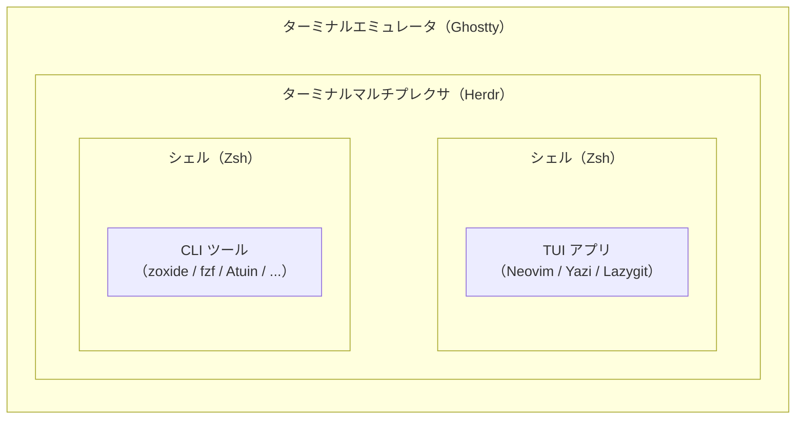

::: message

この記事は基本的に全て人力で作成されています．
AI の使用は情報収集，図の作成補助，誤字脱字のチェックのみです．
2026/8/10 に書かれた記事のため，それ以降の情報は記載されていません．

:::

皆さんはターミナル，使ってますか？

使いますよね．Mac の純正？VS Code の内蔵？なんか怖くてあまり使ってない？なるほど... <br><br><br><br>

### 滅ッッッッッッッッ！！！！！！！！！！！！！！！！<br><br><br><br><br><br><br>

はい，今この瞬間あなたのターミナルへの固定観念を " **滅** " しました．おめでとう．

ターミナルはコピペコマンドを垂れ流す穴ではありません．あらゆる操作ができる万能インターフェースになるのです．この記事を読めばね．


_私のターミナル環境 2026．左側でプロジェクトとコーディングエージェント，右側でファイルを管理し，必要な時にポップアップペインを開いて Git クライアントやファイルマネージャを確認する．_

最終的には，上のようにあらゆる管理をターミナルでできるようになります．

といっても，何が何だか分かりませんよね．いきなりすべてを理解し導入する必要はありません．
この記事では，みなさんにモダンなターミナル生活を送るためのツール群をインパクトの大きいものから紹介します．
その中で，各々のニーズに合ったツールを少しずつ試していただくのが良いかなと思います．

## そもそも「ターミナル環境」とは何なのか

ツールを紹介する前に，ここでいうターミナル環境がどのように構成されているかを整理しておきます．

今回紹介するターミナル環境を雑に分解すると以下のような感じです．



一番外側にあるのが，ターミナルの画面そのものを表示する **ターミナルエミュレータ** です．
その中で **ターミナルマルチプレクサ** が複数のタブを管理し，各タブでは **シェル** がコマンドを受け付けています．
そしてシェルの見た目を整える **シェルプロンプト** や，画面全体を使って操作する **TUI アプリ**，日々の操作を便利にする **CLI ツール** などがその上で動きます．

うーん，わからん．

わからんでも良いです，とりあえずここでいうターミナル環境は色々なもので構成されてて，外側から一個ずつ説明してくんだよっていう前置きです．

## ターミナルエミュレータ

### Ghostty

まずは，普段「ターミナル」と呼んでいるウィンドウそのものから紹介します．
Mac の「ターミナル」や VS Code の内蔵ターミナルのように，文字を表示してキーボードからの入力をシェルへ渡すアプリを **ターミナルエミュレータ** と呼びます．

数あるターミナルエミュレータの中で私は **Ghostty** を使っています．
Ghostty は凝ったカスタマイズをせずとも「軽い・速い・見た目が良い」の三拍子が揃っている点で，最初におすすめしやすい選択肢かなと思います．


_出会って 5 秒で「軽い・速い・見た目が良い」_

:::details 他のターミナルエミュレータとの比較

競合相手としては WezTerm，cmux，Warp などが挙げられますが，Ghostty は凝ったカスタマイズをせずとも上述の三拍子がインストール直後から揃っている点で優位性があると感じています．

最近は cmux のように高度な機能が含まれるターミナルエミュレータがありますが，そこで提供される機能は，（私の欲しい範囲では）基本的にはより軽く柔軟性が高い TUI アプリや CUI ツールで代替できるのでそちらでいいかなと思います．

そのため私は，ターミナルエミュレータ自体には多機能さを求めず，軽くて扱いやすい Ghostty を土台として使っています．

:::

## ターミナルマルチプレクサ

### Herdr

Ghostty 内でいざ開発♪ していると今度はタブが増殖します．
研究用のリポジトリ，別のプロジェクト...などなど．
それぞれでシェルやコーディングエージェントを開いていると，タブも情報量もどんどん増えて聖徳太子の気分になれます．なれません．

そんな複数のタブとエージェントの管理に利用するのが **Herdr** です．
Herdr は一つのターミナルの中に複数の作業領域を持ち，まとめて管理できます．
特筆すべきは，**プロジェクト単位で作業をまとめられること** と，**コーディングエージェントの状態を一覧で確認できること** です．

Codex に作業を投げたあと，終わるまで画面を眺めている必要はありません．
別のプロジェクトへ移動して，あとで左下の一覧を見れば，どのエージェントが作業中で，どれが終わったのか分かります．
冒頭に見せた画面を作っているのはほぼこいつです．


_左上がワークスペース（個別の作業領域），左下が起動している全てのエージェントの状態，右が作業場．ポップアップでファイルや Git を管理できちゃう．_

また，Herdr は最近のアップデートで，設定したショートカットを押すことで後述する TUI アプリなどをポップアップで必要な時にすぐ出せるようになりました．神．

:::details Herdr Popup の設定例

私は以下のようなポップアップのショートカットを設定しています（Herdr の設定ファイルに記述．詳しくは割愛）．

[私の Herdr 設定ファイル](https://github.com/furedea/dotfiles/blob/main/herdr/config.toml)

前提ツールは後述する yazi，lazygit と，Herdr プラグインである herdr-reviewr です．

herdr-reviewr についての説明は本筋から逸れすぎるので割愛します．
気になる人はググってください．

:::

## シェル環境

### Zsh

入力したコマンドを解釈してくれるのが **シェル** です．
私は macOS 標準の **Zsh** をそのまま使っています．

Fish や Nushell などもありますが，POSIX 非互換でコマンドが別物なことがあるので最初は無難に Zsh が良いかなと思います．

### Starship

シェルを開いたときに，現在のディレクトリや `$` `%` などが表示されている部分が **シェルプロンプト** です．
私はこれを **Starship** で表示しています．
例えば，私の環境ではこんな感じで表示されます．

`template-project feat/branch-name [x!?] 🐍 v3.14.6`

リポジトリ名，現在の Git ブランチ，変更の有無，使用している言語やバージョンなどを，コマンドを打たなくても常に確認できます．

::: details Starship の設定例

[私の Starship 設定ファイル](https://github.com/furedea/dotfiles/blob/main/starship/starship.toml)

:::

## TUI アプリ

ここからは，ターミナルの中で動くアプリを紹介します．
一行コマンドを入力して結果を見る CLI と違い，画面全体を使って対話的に操作するものを **TUI（Text User Interface）** と呼びます．

### Yazi

**Yazi** はターミナル上で動くファイルマネージャです．
ざっくり言えばターミナル内で動くキーボード操作の Finder です．

ターミナルに生息する予定なら必須です．これがないターミナル環境は Finder のない Mac です．
操作感はほぼ Vim なので Vim の経験があると手足のように動かせます．
Finder より優れている点は，ターミナルとキーボードから離れなくていいことと，右にでかいプレビューがつくことです．
プラグインで拡張もできるので，使ってて困ることがあったらプラグインを調べましょう．


_ヤージヤジヤジ...Yazi は便利ヤジねえ..._

### Lazygit

Git 操作については，かなり **Lazygit** に頼っています．

`git status` や `git diff` でも操作できますが，複数ファイルの差分を見ながら「これは stage する，これは残す」などと整理するときは TUI でやった方が圧倒的に楽です．
特にエージェントが台頭してから，自分が知らない変更をまとめて確認する機会が増えました．
変更されたファイルと diff を一画面で眺められる恩恵が以前より大きくなっています．

Git コマンドを覚えなくてよくなるツールというより，Git の状態を目視するためのツールとして使っています．


_（プレビューが）デカァァァァァいッ説明不要_

## 移動と検索

### zoxide

導入コストに対して効果がかなり大きいのが **zoxide** です．

普通なら

```sh
cd ~/repositories/k8s-guideline-bench
```

と入力するところを，一度訪れた場所なら

```sh
z k8s
```

くらいで移動できます．

### fzf

**fzf**（Fuzzy Finder）は，ターミナル上にファイルを検索して選択する画面を生やすツールです．
fzf 単体を毎日直接起動するというより，他のコマンドと組み合わせて使うイメージです．

例えば私は ghq，roots という CLI ツールを fzf と組み合わせて，`Ctrl-G` で任意のローカル Git リポジトリを検索して移動できるようにしています．
ghq は Git リポジトリをまとめて管理，roots はモノレポなどの中にあるプロジェクトルートまで探してくれる CLI ツールです．

これらを fzf につなげると，こんな感じになります．


::: details 設定ファイルの記述例

```.zshrc
# ghq + roots + fzf: Ctrl-G to fuzzy-cd into a managed repository, monorepo
# subproject, or worktree. `roots` expands each ghq path to all detected
# project markers (.git/config, go.mod, package.json, Cargo.toml).
function ghq-fzf() {
  local selected
  selected=$(ghq list -p | roots | fzf \
    --height=80% \
    --reverse \
    --preview "
      eza -la --git --icons --color=always {} 2>/dev/null | head -20
      echo
      echo '--- README ---'
      echo
      bat --color=always --style=plain --line-range=:80 \
        {}/README.md \
        {}/README.rst \
        {}/README \
        {}/README.txt \
        {}/readme.md \
        2>/dev/null || echo '(no README)'
    " \
    --preview-window=right:60%:wrap) || return
  BUFFER="builtin cd ${selected}"
  zle accept-line
  zle reset-prompt
}
zle -N ghq-fzf
bindkey '^G' ghq-fzf
```

:::

## コマンド履歴

### Atuin

以前に打ったなっがいコマンドをすぐ検索できるのがコマンド履歴管理ツール， **Atuin** です．

Zsh 標準の履歴検索より強力で，`Ctrl-R` でどのディレクトリで実行したコマンドなのかまで含め検索できます．

さらに Atuin はアカウントを作ると，複数の PC 間でコマンド履歴を同期できます．
例えば MacBook で以前実行したコマンドを，別のマシンからそのまま検索できます．
同期される履歴は End-to-End Encryption されており，自前で Atuin のサーバを立てることもできます（ぶっちゃけそこまで求めてない）．


_意外と便利_

:::details Atuin と組み合わせたいツール

私は Atuin を **zsh-abbr** と組み合わせて使っています．

zsh-abbr は，短縮形を入力すると実行前に本来のコマンドへ展開してくれるツールです．

例えば

```sh
abbr add lg="lazygit"
```

としておけば

```text
lg
```

と入力したものが

```text
lazygit
```

に展開されてから実行されます．

普通の alias と違って，履歴には短縮形ではなく展開後のコマンドを残せるため，Atuin で後から検索しても検索結果が短縮形で汚染されません．
:::

## 基本コマンドの置換

最後は，普段使う基本的なコマンドをより高機能で使いやすい Rust 製ツールに置き換える例です．
どれも必須ではありませんが，ほぼ導入するだけなので気に入ったものだけどうぞ．

- `eza`（高機能な `ls`）
- `bat`（シンタックスハイライト付きの `cat`）
- `fd`（高速で使いやすい `find`）
- `ripgrep`（高速な `grep`）
- `dust`（ディスク使用量を視覚化する `du`）

## おわりに

私が普段使っているターミナル環境と，特に重宝していると感じたツール群を紹介しました．
こうして並べるとだいぶ大げさですが，別に全部を導入する必要はありません．

`cd` が面倒なら zoxide．
Git の差分確認が面倒なら lazygit．
ターミナルのタブが増殖しているなら Herdr．

みたいな感じで，普段面倒に感じる操作を一つずつ置き換えていけば十分だと思います．

ターミナル環境を整える目的は，黒い画面をいい感じに光らせて「俺のターミナルかっこ EEEEE」と気持ち良くなるだけではありません．
毎日何十回，何百回と繰り返す操作を少しずつ楽にすることです．
そうしていくうちに気付けば，ターミナルは単にコマンドを入力する場所ではなく，ファイルを探し，コードを書き，Git を操作し，コーディングエージェントまで管理する作業場になります．

それでは，よいターミナルライフを！
